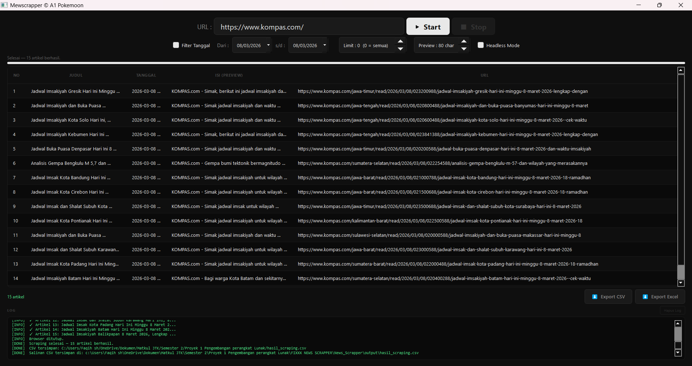
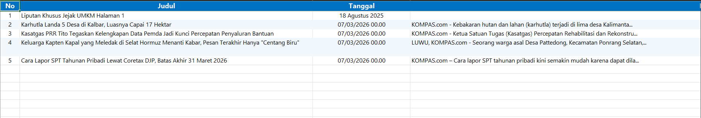

# MewScrapper — Aplikasi Scraping Berita Otomatis

> Aplikasi desktop Python untuk mengumpulkan artikel berita secara otomatis dari berbagai website berita Indonesia menggunakan Selenium dan PyQt5.

---

## Anggota Kelompok

**Kelompok A1 D4_1A Teknik Informatika**

| Nama | Peran | File |
|---|---|---|
| **Faqih** | Threading & Integrasi (Lead) | `main.py`, `utils/worker_thread.py`, `README.md` |
| **Bima** | Selenium Scraper | `scraper/selenium_scraper.py`, `scraper/article_extractor.py` |
| **Fatih** | GUI Developer (PyQt5) | `gui/main_window.py`, `gui/dialogs.py` |
| **Anin** | Export & Filter Tanggal | `utils/exporter.py`, `utils/date_filter.py` |
| **Irfan** | Logging & Laporan PDF | `utils/logger.py`, `docs/laporan.pdf` |

---

## Deskripsi Aplikasi

Aplikasi ini merupakan sebuah sistem web scraping berita yang dirancang untuk mengumpulkan data artikel secara otomatis dari sebuah website portal berita. Pengguna hanya perlu memasukkan URL halaman berita, kemudian sistem akan menelusuri halaman tersebut untuk mengumpulkan link artikel yang tersedia. Selanjutnya, aplikasi akan mengunjungi setiap artikel untuk mengekstrak informasi penting seperti judul berita, tanggal publikasi, isi artikel, dan URL.

Data yang berhasil diperoleh ditampilkan secara langsung pada antarmuka aplikasi dan dapat disaring berdasarkan rentang tanggal tertentu sesuai kebutuhan pengguna. Hasil scraping kemudian dapat disimpan dalam format CSV atau Microsoft Excel sehingga mudah digunakan untuk analisis data, dokumentasi, maupun penelitian.

---

## Fitur Utama

- **Scraping otomatis** — input URL, klik Start, semua artikel dikumpulkan otomatis
- **Real-time display** — artikel muncul satu per satu saat berhasil di-scrape
- **Multi-website** — mendukung berbagai website berita Indonesia (CNN Indonesia, Detik, Kompas, Tribun, dll)
- **Filter tanggal** — saring artikel berdasarkan rentang tanggal tertentu
- **Limit artikel** — batasi jumlah artikel yang ingin dikumpulkan
- **Custom karakter konten** — pilih berapa karakter isi artikel yang ditampilkan
- **Export CSV & Excel** — simpan hasil scraping ke file
- **Tombol Stop** — hentikan proses scraping kapan saja
- **Panel log** — pantau aktivitas scraping secara real-time
- **Headless mode** — Chrome berjalan di background tanpa muncul di layar

---

## Teknologi yang Digunakan

| Library | Versi | Fungsi |
|---|---|---|
| `selenium` | >=4.0.0 | Otomatisasi browser Chrome untuk scraping |
| `webdriver-manager` | >=4.0.0 | Auto-download ChromeDriver sesuai versi Chrome |
| `PyQt5` | >=5.15.0 | Framework pembuatan GUI desktop |
| `openpyxl` | >=3.1.0 | Export data ke format Excel (.xlsx) |
| `dateparser` | >=1.1.0 | Parse format tanggal bahasa Indonesia dan Inggris |
| `beautifulsoup4` | >=4.12.0 | Parsing HTML sebagai helper ekstraksi konten |
| `newspaper3k` | >=0.9.3 | Ekstraksi artikel dan metadata dari website berita |

---

## Struktur Project

```
news-scraper/
├── main.py                      # Entry point aplikasi (Faqih)
├── requirements.txt             # Daftar library yang dibutuhkan
├── README.md                    # Dokumentasi project (Faqih)
├── .gitignore                   # File yang diabaikan Git
│
├── scraper/                     # Modul scraping (Bima)
│   ├── __init__.py
│   ├── selenium_scraper.py      # Fungsi utama scraping
|   |── search_article.py        # Helper pencarian link artikel
│   └── article_extractor.py    # Helper ekstraksi konten
│
├── gui/                         # Modul GUI (Fatih)
│   ├── __init__.py
│   ├── main_window.py           # Jendela utama aplikasi
│   
├── utils/                       # Modul utilitas
│   ├── __init__.py
│   ├── worker_thread.py         # Threading scraping (Faqih)
│   ├── exporter.py              # Export CSV & Excel (Anin)
│   ├── date_filter.py           # Filter tanggal (Anin)
│   └── logger.py                # Logging sistem (Irfan)
│
├── docs/                        # Dokumentasi
│   ├── laporan.pdf              # Laporan teknis (Irfan)
│   └── screenshots/             # Screenshot aplikasi 
│
├── logs/                        # File log (auto-generated)
│   └── app.log
│
└── output/                      # Hasil export (auto-generated)
```

---

## Instalasi

### Prasyarat
- Python 3.8 atau lebih baru
- Google Chrome (versi terbaru)
- Git

### Langkah Instalasi

**1. Clone repository**
```bash
git clone https://github.com/Dwdun/news-scraper.git
cd news-scraper
```

**2. Install semua library**
```bash
pip install -r requirements.txt
```

Atau install manual:
```bash
pip install selenium webdriver-manager PyQt5 openpyxl dateparser beautifulsoup4 newspaper3k
```

**3. Jalankan aplikasi**
```bash
python main.py
```

---

## Panduan Penggunaan

### Scraping Artikel

1. Buka aplikasi dengan `python main.py`
2. Masukkan URL halaman berita di kolom input, contoh:
   ```
   https://www.cnnindonesia.com/nasional
   ```
3. Atur pengaturan opsional:
   - **Limit artikel** — isi angka jika ingin membatasi jumlah artikel (0 = semua)
   - **Filter tanggal** — centang dan pilih rentang tanggal
   - **Max karakter konten** — pilih berapa karakter isi artikel yang ditampilkan
   - **Headless mode** — centang agar Chrome tidak muncul di layar
4. Klik tombol **Start** untuk memulai
5. Artikel akan muncul satu per satu di tabel secara real-time
6. Klik **Stop** kapan saja untuk menghentikan proses

### Export Data

1. Tunggu hingga scraping selesai atau klik Stop
2. Klik **Export CSV** untuk menyimpan ke format `.csv`
3. Klik **Export Excel** untuk menyimpan ke format `.xlsx`
4. Pilih lokasi penyimpanan di dialog yang muncul

### Filter Tanggal

1. Centang checkbox **Filter Tanggal**
2. Pilih tanggal mulai dan tanggal akhir
3. Hanya artikel dalam rentang tanggal tersebut yang akan ditampilkan
4. Klik Start untuk mulai scraping dengan filter aktif

---

## Website yang Didukung

| Website | URL | Status |
|---|---|---|
| CNN Indonesia | cnnindonesia.com | Direkomendasikan |
| Detik | detik.com | Direkomendasikan |
| Kompas | kompas.com | Direkomendasikan |
| Tribun News | tribunnews.com | Direkomendasikan |
| Tempo | tempo.co | Mungkin lebih lambat |

> **Catatan:** Website yang memerlukan login atau menggunakan proteksi anti-bot (Cloudflare) tidak dapat di-scrape.

---

## Format Data Hasil Scraping

| Kolom | Tipe | Deskripsi |
|---|---|---|
| `No` | int | Nomor urut artikel |
| `Judul` | str | Judul artikel berita |
| `Tanggal` | str | Tanggal publikasi artikel |
| `Isi` | str | Isi/konten artikel (bisa di-custom max karakternya) |
| `URL` | str | Link langsung ke artikel |

---

## Konfigurasi

### Headless Mode
- Di GUI: hilangkan centang pada checkbox **Headless mode**
- Di kode (`scraper/selenium_scraper.py`): hapus baris `options.add_argument('--headless')`

### Mengubah Batas Konten Artikel
Bisa langsung diatur dari GUI melalui input **Max Karakter Konten**.

Atau di kode `scraper/article_extractor.py`:
```python
def extract_content(driver, max_chars=600):
    ...
    return content[:max_chars]  # ubah angka default sesuai kebutuhan
```

---

## Troubleshooting

### Chrome tidak ditemukan
```
WebDriverException: Chrome not found
```
**Solusi:** Install Google Chrome dari [chrome.google.com](https://chrome.google.com). Aplikasi juga mendukung Brave, Chromium, dan Edge secara otomatis.

### ChromeDriver versi tidak cocok
```
SessionNotCreatedException: Chrome version mismatch
```
**Solusi:** `webdriver-manager` akan otomatis download ChromeDriver yang sesuai. Pastikan koneksi internet aktif saat pertama kali menjalankan.

### Artikel tidak berhasil di-scrape
```
Artikel: 0 dari X berhasil
```
**Solusi:** Matikan headless mode, cek apakah website memerlukan login, atau tambah delay di `time.sleep()`.

### PyQt5 tidak terinstall
```
ModuleNotFoundError: No module named 'PyQt5'
```
**Solusi:** `pip install PyQt5`

---

## Alur Kerja Aplikasi

```
User input URL
      ↓
ScraperWorker.start() — berjalan di background thread
      ↓
setup_driver() — inisialisasi Chrome headless
      ↓
get_article_links() — kumpulkan semua URL artikel (max 3 halaman pagination)
      ↓
Loop setiap URL:
  scrape_article() — ekstraksi judul/tanggal/isi
  emit article_ready → tampil di GUI
  emit progress_update → update progress bar
      ↓
emit finished() — scraping selesai
      ↓
User klik Export → simpan ke CSV/Excel
```

---

## Kontribusi (Untuk Anggota Tim)

| Branch | Penanggung Jawab |
|---|---|
| `feature/faqih-threads` | Faqih |
| `feature/bima-scraper` | Bima |
| `feature/fatih-gui` | Fatih |
| `feature/anin-export` | Anin |
| `feature/irfan-logs` | Irfan |

---

## Preview Aplikasi

### Scrapping:


### Output:


## Lisensi

Project ini dibuat untuk keperluan Tugas Proyek 1 Pengembangan Perangkat Lunak.

---

*Kelompok A1 D4_1A Teknik Informatika*
